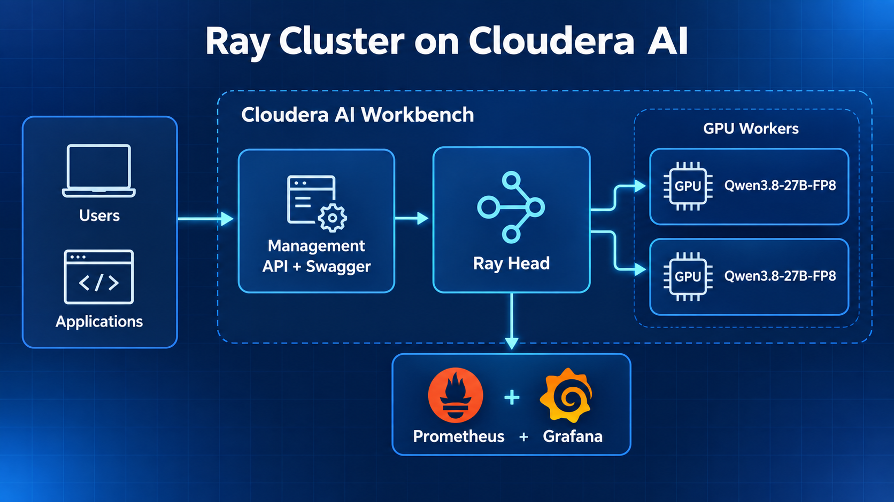
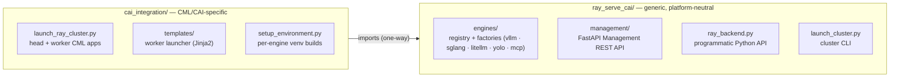
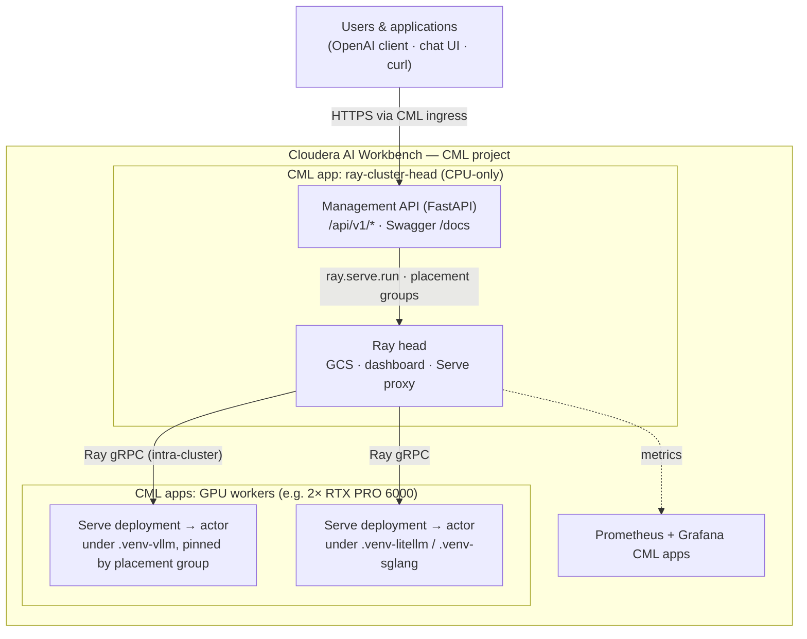

# ray-serve-cai

[](https://www.python.org/downloads/)
[](https://opensource.org/licenses/Apache-2.0)
[](https://docs.ray.io/)

**Ray Serve orchestration for model inference on Cloudera AI.**

`ray-serve-cai` turns a set of Cloudera AI (CAI) / Cloudera Machine Learning (CML)
Applications into a live Ray cluster and gives you a single REST API to deploy,
scale, place, and monitor inference workloads on it — vLLM and SGLang LLMs, a
LiteLLM gateway, YOLO vision models, MCP tool servers, or any custom Ray Serve app.

Each engine runs in its own isolated Python virtual environment so mutually
incompatible dependency stacks (e.g. vLLM vs SGLang) coexist on the same cluster,
and every deployment can be pinned to specific nodes and GPU topologies through a
declarative scheduling block.

---

## Table of Contents

- [Overview](#overview)
- [Demo](#demo)
- [Target Audience](#target-audience)
- [Use Cases](#use-cases)
- [Key Features](#key-features)
- [Architecture](#architecture)
- [Installation](#installation)
- [Prerequisites](#prerequisites)
- [Hardware Requirements](#hardware-requirements)
- [Concepts](#concepts)
- [Quick start](#quick-start)
  - [1. Launch a cluster](#1-launch-a-cluster)
  - [2. Run the Management API](#2-run-the-management-api)
  - [3. Deploy a model](#3-deploy-a-model)
  - [4. Query it](#4-query-it)
- [Supported engines](#supported-engines)
- [Performance](#performance)
- [Optimizations](#optimizations)
- [Cost](#cost)
- [Multi-modal (YOLO)](#multi-modal-yolo)
- [The Management REST API](#the-management-rest-api)
  - [Applications](#applications--apiv1applications)
  - [Scheduling & placement groups](#scheduling--placement-groups)
  - [Environments (venv isolation)](#environments--apiv1environments)
  - [Resources & nodes](#resources--nodes--apiv1resources)
  - [Engines](#engines--apiv1engines)
  - [Cluster & metrics](#cluster--metrics)
- [Node targeting](#node-targeting)
- [Adding a custom engine](#adding-a-custom-engine)
- [Configuration reference](#configuration-reference)
- [Project layout](#project-layout)
- [Development](#development)
- [Troubleshooting](#troubleshooting)
  - [Ray cluster pods fail to connect — Istio STRICT mTLS](#ray-cluster-pods-fail-to-connect--istio-strict-mtls)
- [Documentation](#documentation)
- [License](#license)

---

## Overview

Serving models on CAI/CML has three recurring pain points that this project solves:

1. **No native multi-node Ray on CML.** CML exposes *Applications* (long-running
   containers) but no first-class Ray cluster. `cai_integration` launches one CML
   Application as the Ray head and N more as workers, wiring them into a single
   cluster over the pod network.
2. **Engine dependency conflicts.** vLLM and SGLang require incompatible
   `llguidance` versions and cannot share one environment. Each engine is
   installed into its own venv (`/home/cdsw/.venv-<engine>`) on shared NFS, and
   the actor for that engine is launched under that interpreter via Ray's
   `py_executable` runtime env.
3. **Hard-to-express placement.** Getting tensor-parallel shards onto the right
   GPUs, or a fractional-GPU + KV-cache topology onto one node, normally means
   hand-writing Ray placement groups. This project derives sensible placement
   groups automatically and lets you override any part of them declaratively.

## Demo

The fastest way to see this running is a one-click AMP import:

1. **Import as a prototype** — in CAI Workbench, create a project from this
   repository. The [`.project-metadata.yaml`](.project-metadata.yaml) manifest
   then runs the full chain automatically: base venv → vLLM venv → LiteLLM
   venv → Ray cluster (head + GPU workers) → Prometheus/Grafana, and finally
   deploys `VLLM_MODEL_ID` (default `Qwen/Qwen3.8-27B-FP8`, TP=2) and runs a
   sample query.
2. **Open the head app** — `https://ray-cluster-head.<CDSW_DOMAIN>`: chat UI
   at `/`, interactive Swagger at `/docs`.
3. **Deploy & query any model** — `POST /api/v1/applications` with any
   HuggingFace model ID, then query it with the OpenAI client
   (see [Quick start](#quick-start)).

> 🎬 A recorded Reprise walkthrough of this flow is planned — the link will be
> added here once the AMP import is validated on a live workbench.

## Target Audience

- **ML Engineers** deploying LLMs or vision models at scale on Cloudera AI
- **Data Scientists** who need GPU-backed inference without managing Kubernetes directly
- **Platform Engineers** operating CAI workbench clusters and needing multi-engine, multi-tenant serving
- **Application Developers** building services on top of OpenAI-compatible inference endpoints

## Use Cases

| Use case | How this project covers it |
|---|---|
| **LLM serving microservice** | Deploy vLLM or SGLang behind a stable HTTP route; query via OpenAI client |
| **Multi-model A/B or routing** | Deploy N models simultaneously; route traffic at the application layer via LiteLLM gateway |
| **Large-model tensor parallelism** | Spread a 27B–70B+ model across 2+ GPUs with one declarative `tensor_parallel_size` field |
| **Fractional-GPU multi-tenancy** | Pack multiple small models onto one GPU node with `gpu_fraction` |
| **Vision / multi-modal inference** | YOLO object detection engine; batched image requests via the same REST API |
| **Tool servers (MCP)** | Host Model Context Protocol servers as Ray Serve apps on the same cluster |
| **Cost-optimised batch routing** | Use LiteLLM to route to cheaper external providers when GPU capacity is at peak |

## Key Features

- **Engine isolation** — vLLM and SGLang (conflicting `llguidance` deps) coexist
  on one cluster via per-engine virtualenvs on shared NFS.
- **Declarative GPU placement** — tensor parallelism, fractional GPU, node
  affinity, and placement-group strategy in one `scheduling` block.
- **Single Management REST API** — deploy, scale, place, and monitor every
  engine through `/api/v1/*`, with Swagger at `/docs`.
- **OpenAI-compatible serving** — every LLM deployment exposes
  `/v1/chat/completions`, `/v1/completions`, `/v1/models`, `/metrics`.
- **Built-in monitoring** — Prometheus + Grafana CML apps provisioned by the
  same job chain that launches the cluster.
- **Multi-modal & tool servers** — YOLO vision and MCP tool engines run on the
  same cluster as the LLMs.

## Architecture

The repository is a **library + deployment template** with a clean split —
`cai_integration` depends on `ray_serve_cai` one-way:



The graphic shows the intended Qwen serving path: clients reach the Management
API on the Ray head, which schedules the tensor-parallel GPU workers; the same
AMP job chain provisions Prometheus and Grafana for monitoring.



At runtime everything lives inside the Cloudera AI workbench: the head CML app
serves the Management API and runs Ray's head; GPU worker CML apps run the
Serve deployment actors, each under its own isolated venv from shared NFS:



## Installation

Requires **Python 3.9+** and **Ray[serve] ≥ 2.53.0**.

```bash
# Core library (orchestration, Management API, cluster CLI)
pip install -e .

# With an inference engine — pick ONE of vllm / sglang; they conflict on llguidance
pip install -e ".[vllm]"     # vLLM >= 0.13.0 (+ ninja for FlashInfer JIT on T4/SM7.5)
pip install -e ".[sglang]"   # SGLang >= 0.5.7
pip install -e ".[yolo]"     # Ultralytics YOLO + Pillow + OpenCV

# Tooling
pip install -e ".[dev]"      # pytest, ruff, black, mypy
pip install -e ".[docs]"     # mkdocs-material
```

> **Note on `[all]`**: there is intentionally no combined install. vLLM and SGLang
> require conflicting `llguidance` versions, so they must live in separate venvs.
> On a running cluster this is handled for you by the [Environments API](#environments--apiv1environments).

GPU inference additionally needs CUDA 11.8+ and a compatible driver on the worker nodes.

## Prerequisites

- **Cloudera AI Workbench** project with GPU node access for inference (or a
  bare Python 3.9+ machine for local development).
- **Ray[serve] ≥ 2.53.0** — installed for you by the setup jobs.
- **Compatible CUDA driver** on GPU nodes — CUDA ≥ 12.9 for Blackwell GPUs
  (toolchain details in `docs/BLACKWELL_CUDA_NVCC_NCCL.md`).
- **Cluster-admin access** (platform team) to apply the Istio
  `PeerAuthentication` fix in [Troubleshooting](#troubleshooting) **before the
  first cluster launch** — worker pods will not stay connected without it.
- **HuggingFace token** only for gated models.

## Hardware Requirements

| Deployment | Head (CPU-only) | GPU workers | Notes |
|---|---|---|---|
| **Minimum (demo)** | 12 CPU / 32 GB | 1× dual-GPU node (2× RTX PRO 6000 96 GB; 44 CPU / 320 GB) | serves 27B FP8 at TP=2 |
| **Development** | 8 CPU / 16 GB | 1× single-GPU (L40s 48 GB or T4 16 GB) | 7–8B models at TP=1 |
| **Production** | 32 CPU / 64 GB | N × dual-GPU nodes | scale via `POST /api/v1/resources/nodes/add` |

Rough per-model GPU memory: ~16 GB for 7B (BF16); ~30 GB for 27B FP8 (TP=1 on
48 GB, or TP=2); ~80–100 GB for 70B FP8 (TP=2 on 2× 48 GB or a 96 GB GPU —
KV cache included).

## Concepts

| Term | Meaning |
|------|---------|
| **Head node** | The Ray head. Runs the Management API and coordination. **No GPUs.** |
| **Worker node** | A CML Application that joins the cluster and carries GPUs/CPU for inference. |
| **Engine** | A registered inference backend: `vllm`, `sglang`, `litellm`, `yolo`, `mcp`, or custom. |
| **Application** | A Ray Serve deployment. Created via `POST /api/v1/applications`. |
| **Environment** | An isolated venv at `/home/cdsw/.venv-<name>` that an engine's actor runs under. |
| **`node_type`** | A logical worker-group label (e.g. `l40-gpu-worker`) registered as a Ray resource. |
| **`node_label`** | A Kubernetes node-selector label used to place a worker *pod* onto a specific K8s node. |
| **SchedulingConfig** | Declarative actor resources, placement-group bundles, strategy, and env vars for a deployment. |

## Quick start

### 1. Launch a cluster

**Local (single machine, for development):**

```bash
python -m ray_serve_cai.launch_cluster start
python -m ray_serve_cai.launch_cluster status
```

**Distributed on Cloudera AI (1 head + N workers as CML Applications):**

```yaml
# cai_cluster.yaml
cai:
  host: https://ml.example.cloudera.site
  api_key: your-api-key
  project_id: your-project-id
  num_workers: 2
  resources:            # worker resources (GPUs live here)
    cpu: 16
    memory: 64
    num_gpus: 1
  head_resources:       # head is CPU-only
    cpu: 8
    memory: 32
```

```bash
python -m ray_serve_cai.launch_cluster --config cai_cluster.yaml start-cai
python -m ray_serve_cai.launch_cluster status-cai
python -m ray_serve_cai.launch_cluster stop-cai
```

The CLI (`ray-serve-cai` console script, or `python -m ray_serve_cai.launch_cluster`)
supports: `start`, `stop`, `status`, `get-address`, `start-autoscaler`,
`start-cai`, `stop-cai`, `status-cai`. See the
[CAI Cluster Guide](docs/cai_cluster_guide.md).

### 2. Run the Management API

On CML the head-node Application serves the Management API automatically. To run it
directly (e.g. locally against `RAY_ADDRESS=auto`):

```bash
python -m ray_serve_cai.management.app
# → http://<host>:<CDSW_APP_PORT|8080>
#   Swagger UI at /docs, ReDoc at /redoc, health at /api/health
```

### 3. Deploy a model

Everything deploys through one endpoint — `POST /api/v1/applications`:

```bash
# Strong model (27B FP8, TP=2 across 2 GPUs) — confirmed working on RTX PRO 6000 / L40s
curl -X POST http://<head>/api/v1/applications \
  -H 'Content-Type: application/json' \
  -d '{
        "name": "qwen3-27b",
        "engine_type": "vllm",
        "model": "Qwen/Qwen3.8-27B-FP8",
        "route_prefix": "/qwen3",
        "tensor_parallel_size": 2,
        "engine_config": {
          "dtype": "auto",
          "max_model_len": 131072,
          "gpu_memory_utilization": 0.95,
          "enable_prefix_caching": true,
          "trust_remote_code": true
        },
        "scheduling": {
          "resources": {"node_type:rtxpro6000-gpu-worker": 0.001}
        }
      }'

# Smaller model (7B, single GPU) — for lighter workloads or development
curl -X POST http://<head>/api/v1/applications \
  -H 'Content-Type: application/json' \
  -d '{
        "name": "qwen2-7b",
        "engine_type": "vllm",
        "model": "Qwen/Qwen2.5-7B-Instruct",
        "route_prefix": "/qwen2",
        "tensor_parallel_size": 1,
        "engine_config": {"dtype": "bfloat16", "gpu_memory_utilization": 0.9},
        "scheduling": {"resources": {"node_type:l40-gpu-worker": 0.001}}
      }'
```

Deployment is asynchronous: the call returns `deploying` and Ray Serve brings the replica
up in the background. Poll `GET /api/v1/applications/qwen3-27b` for status.

### 4. Query it

Each LLM engine serves OpenAI-compatible routes under its `route_prefix`:

```python
from openai import OpenAI

client = OpenAI(base_url="http://<head>/qwen3/v1", api_key="not-required")
resp = client.chat.completions.create(
    model="Qwen/Qwen3.8-27B-FP8",
    messages=[{"role": "user", "content": "Explain tensor parallelism in two sentences."}],
)
print(resp.choices[0].message.content)
```

Available per deployment: `POST {prefix}/v1/completions`,
`POST {prefix}/v1/chat/completions`, `GET {prefix}/v1/models`,
`GET {prefix}/health`, and (vLLM/SGLang) `GET {prefix}/metrics`.

## Supported engines

| Engine | `engine_type` | Status | Notes |
|--------|---------------|--------|-------|
| **vLLM** | `vllm` | ✅ Stable | High-throughput LLM serving; tensor parallelism, fractional GPU, multi-node. |
| **SGLang** | `sglang` | ✅ Stable | Runs SGLang's server as a subprocess; native Prometheus metrics. |
| **LiteLLM** | `litellm` | ✅ Stable | Proxy/gateway to external providers (OpenAI, Anthropic, …); no local model. |
| **YOLO** | `yolo` | ✅ Stable | Ultralytics object detection; batched inference. |
| **MCP** | `mcp` | ✅ Stable | Model Context Protocol tool servers. |
| **Custom** | *(your name)* | 🔌 Extensible | Register your own via the engine registry. |

## Performance

The existing `Qwen/Qwen3.8-27B-FP8` deployment passed an authenticated completion
check on 2026-09-13. See the [sanitized validation record](docs/validation/qwen_live_validation_2026-09-13.md).
That single request establishes functional inference only. A reproducible load
benchmark has not yet been retained, so throughput and TTFT figures are not
published here.

For the planned benchmark, record the exact deployment payload, GPU SKU/count,
Ray/vLLM/torch/CUDA versions, sampler mode, prompt/output token counts, concurrency,
duration, failures, and TTFT/E2E percentiles. In the separate benchmark checkout:

```bash
cd ray-serve-cai-bench
# set BASE_URL, VLLM_ROUTE=/qwen3-8, VLLM_MODEL=Qwen/Qwen3.8-27B-FP8 in configs/cluster.env
locust -f locust/locustfile_chat.py --headless -u 10 -r 2 -t 60s
```

## Optimizations

Throughput and latency come from a stack of orthogonal knobs — most are
enabled by the deployment payload, none require code changes:

| Optimization | What it does | How to enable |
|---|---|---|
| **FP8 quantisation** | Halves weight memory vs BF16 → bigger batch + longer context per GPU | use an FP8 model checkpoint (e.g. `Qwen3.8-27B-FP8`) with `"dtype": "auto"` |
| **Tensor parallelism** | Splits one model across N GPUs → models too big for one card, and more KV-cache headroom | `"tensor_parallel_size": 2` |
| **Prefix caching** | Reuses KV blocks shared across requests (system prompts, few-shot) | `"enable_prefix_caching": true` |
| **CUDA graphs** | Captures the decode loop as a graph → removes per-step kernel-launch overhead | on by default in vLLM v1 |
| **Chunked prefill** | Interleaves long-prefill and decode work → stable TTFT under mixed load | on by default in vLLM v1 |
| **Fractional GPU** | Packs multiple small models on one GPU | `"gpu_fraction": 0.5` |
| **venv isolation** | vLLM and SGLang coexist on one cluster (conflicting deps) | automatic — per-engine virtualenvs |
| **Node pinning** | Shards land on the right GPU node, not just the scheduler | `scheduling.resources` (merged into GPU bundles) |

The table describes available configuration options. Their performance effects
must be measured with the benchmark configuration described above; the existing
Qwen functional check does not establish an optimization speedup.

## Cost

Inference cost is dominated by GPU-hours, so the levers are **model size,
quantisation, parallelism, and packing** — not framework overhead:

| Scenario | GPUs used | When it's the right call |
|---|---|---|
| 7B BF16, TP=1, single L40s | 1 × 48 GB (can share at `gpu_fraction`) | dev / low traffic; cheapest per token |
| 27B FP8, TP=2 | Example deployment: 2 × 96 GB on one node | one-pod TP; measure throughput and cost for your workload |
| 27B BF16, TP=2 | ≈54 GB weights plus KV cache and runtime overhead across the GPUs | size for the required context and concurrency; compare with FP8 |
| 2 × 7B replicas, TP=1 each | 2 × 48 GB | higher *aggregate* throughput at lower quality than one 27B |

Rules of thumb:

- **Evaluate FP8.** Compare task quality and tokens/GPU-hour against smaller
  models using the same workload before selecting the deployment.
- **TP=2 on one dual-GPU node, not two single-GPU nodes.** Cross-pod tensor
  parallelism over the CML network is blocked by Istio (see
  [Troubleshooting](#troubleshooting)); single-pod TP is the supported path.
- **Off-peak to external APIs.** Route bulk/low-urgency traffic through the
  LiteLLM engine to a hosted provider instead of holding a GPU idle for it.
- **Right-size the head.** The head is CPU-only by design — don't pay for
  GPUs you never use.

To price a deployment, multiply its GPU count by your node's $/GPU-hour
(ask your platform team for the internal rate) and the time served; divide by
the sustained token throughput from a [Locust](#performance) run for a
$/1M-tokens figure to compare against hosted API pricing.

## Multi-modal (YOLO)

Object detection runs on the same cluster with the same API surface:

```bash
curl -X POST http://<head>/api/v1/applications \
  -H 'Content-Type: application/json' \
  -d '{
        "name": "yolo-detect",
        "engine_type": "yolo",
        "route_prefix": "/yolo",
        "engine_config": {
          "model_path": "yolo11n.pt",
          "conf_threshold": 0.25,
          "iou_threshold": 0.45,
          "device": "cuda:0"
        },
        "scheduling": {"resources": {"node_type:rtxpro6000-gpu-worker": 0.001}}
      }'
```

Then run detection (multipart image upload) — the engine batches concurrent
images to maximise GPU utilisation:

```bash
curl -X POST http://<head>/yolo/v1/detect -F "file=@street.jpg"
# → {"detections": [{"label": "car", "confidence": 0.91, "location": ...}, ...]}
```

`GET /yolo/info` returns model metadata; interactive Swagger at `/yolo/docs`.
YOLO-nano class models run comfortably at `gpu_fraction: 0.25` alongside an
LLM deployment on the same GPU.

## The Management REST API

All endpoints are under `/api/v1`. Full interactive schema is at `/docs`.

### Applications — `/api/v1/applications`

A single, unified deployment endpoint. Provide **exactly one** discriminator:
`engine_type` (engine-registry path) **or** `import_path` (raw Ray Serve app).
Supplying both or neither is a `422`.

| Method | Path | Description |
|--------|------|-------------|
| `POST` | `/applications` | Deploy an engine model **or** a raw Ray Serve app. |
| `GET` | `/applications` | List all Serve applications (with live status, route, replicas). |
| `GET` | `/applications/{name}` | Get one application. |
| `DELETE` | `/applications/{name}` | Undeploy an application. |
| `POST` | `/applications/model` | **Deprecated** — 308-redirects to `/applications`. |

Raw Ray Serve app example:

```json
{
  "name": "my-service",
  "import_path": "my_module:app",
  "route_prefix": "/svc",
  "ray_actor_options": {"num_cpus": 2},
  "scheduling": {"resources": {"node_type:cpu-worker": 0.001}}
}
```

> `import_path` is validated to `module:attribute` format and checked against the
> `ALLOWED_ENGINE_MODULES` allowlist (default `custom_engines,ray_serve_cai`) before
> import, to prevent arbitrary module execution.

### Scheduling & placement groups

Every deployment accepts a `scheduling` block that gives you full, declarative
control over where and how its actors are placed:

```jsonc
"scheduling": {
  // Node affinity for this deployment's GPU work. Use 0.001 for soft affinity
  // (a hint that consumes no capacity). Merged into GPU placement-group bundles
  // when a placement group is used, else set on the actor directly.
  "resources": {"instance-group-id:ig-n4bsnv8r": 0.001},

  // Full per-bundle override. Each dict is one bundle; keys are Ray resource
  // names (custom node labels allowed), values are quantities.
  "placement_group_bundles": [
    {"CPU": 2.0, "GPU": 0.01},
    {"GPU": 0.99},
    {"GPU": 0.99}
  ],

  // PACK | STRICT_PACK | SPREAD | STRICT_SPREAD
  "placement_group_strategy": "STRICT_PACK",

  // Actor env vars, merged with the venv runtime env (dangerous keys such as
  // LD_PRELOAD / PYTHONPATH are rejected).
  "env_vars": {"VLLM_RAY_PER_WORKER_GPUS": "0.99", "VLLM_RAY_BUNDLE_INDICES": "1,2"}
}
```

When you omit `placement_group_bundles`, sensible defaults are generated per
scenario:

| Scenario | Auto placement group |
|----------|----------------------|
| `tensor_parallel_size > 1`, single-node | scheduler `{CPU:4}` + `tp × {GPU:1}` bundles, `STRICT_PACK` |
| `tensor_parallel_size > 1`, `multi_node: true` | `{CPU:4}` scheduler + `tp × {GPU:1}` executor bundles, `PACK` |
| `gpu_fraction < 1` | one `{GPU: fraction, CPU: 2}` bundle, `PACK` |
| plain single GPU / CPU | no placement group |

`scheduling.resources` labels are automatically merged into the **GPU-bearing
bundles** so every shard lands on the target nodes — not just the coordinating
actor. This is the difference between pinning the scheduler and pinning the
actual GPU work.

### Environments — `/api/v1/environments`

Manage the isolated venvs (`/home/cdsw/.venv-<name>`) that engine actors run under.
Creation runs `uv venv` + `uv pip install` in a background thread (heavy engines
like vLLM can take minutes), so `POST` returns `202` immediately — poll to see
readiness.

| Method | Path | Description |
|--------|------|-------------|
| `GET` | `/environments` | List all venvs (on-disk + in-flight creations). |
| `POST` | `/environments` | Create a venv `{name, packages, python?}` → `202`. |
| `GET` | `/environments/{name}` | Status of one venv. |

```bash
curl -X POST http://<head>/api/v1/environments \
  -H 'Content-Type: application/json' \
  -d '{"name": "vllm-013", "packages": ["vllm==0.27.1", "ninja"]}'
```

Then deploy against it with `"venv_name": "vllm-013"` on the application request.

### Resources & nodes — `/api/v1/resources`

Add and inspect worker nodes. Each worker is a CML Application that joins the cluster.

| Method | Path | Description |
|--------|------|-------------|
| `POST` | `/resources/nodes` | Add a worker node (creates a CML App). Returns `201` with `app_id`. |
| `DELETE` | `/resources/nodes/{app_id}` | Remove a worker node (stops the CML App). |
| `GET` | `/resources/nodes` | List Ray nodes enriched with CML `app_id`, `app_name`, `cml_status`. |
| `GET` | `/resources/workers` | **Deprecated** — use `/resources/nodes`. |
| `GET` | `/resources/allocation` | API-tracked resource allocations. |
| `GET` | `/resources/capacity` | Live Ray cluster capacity & utilization. |

### Engines — `/api/v1/engines`

| Method | Path | Description |
|--------|------|-------------|
| `GET` | `/engines` | List registered engine types and the default engine. |
| `POST` | `/engines/register` | Dynamically register a custom engine (allowlist-gated). |

### Cluster & metrics

| Method | Path | Description |
|--------|------|-------------|
| `GET` | `/cluster/status` | Node counts, app counts, resource utilization. |
| `GET` | `/cluster/info` | Head address, dashboard URL, Ray version. |
| `GET` | `/cluster/gcs-address` | Internal Ray GCS address for workers to join. |
| `GET` | `/metrics` | Head node Prometheus metrics. |
| `GET` | `/metrics/all` | Aggregated metrics from all alive nodes (10 s cache). |
| `GET` | `/metrics/apps` | Per-application metrics (e.g. vLLM). |
| `GET` | `/metrics/discovery` | Prometheus HTTP service-discovery targets. |

There is also `/api/v1/cml-apps` for launching/stopping generic (non-worker) CML
Applications on the cluster.

## Node targeting

Placement works at two layers, both driven from a single label you supply when
adding a worker:

1. **Pod placement (Kubernetes).** `node_label` on `POST /resources/nodes` becomes
   the pod's `NODE_SELECTOR_KEY/VALUE`, steering the worker container onto a
   specific K8s node. The right key is provider-specific:
   - Cloudera/Liftie: `liftie.cloudera.com/instance-group-id`
   - EKS: `node.kubernetes.io/instance-type`
   - NVIDIA GFD: `nvidia.com/gpu.product`
2. **Actor scheduling (Ray).** The same `node_label` is auto-derived into a
   short-key Ray resource (e.g. `instance-group-id:ig-n4bsnv8r=1`) so that
   deployments can target that exact node via `scheduling.resources`.

```bash
# Add a worker pinned to a specific K8s node group
curl -X POST http://<head>/api/v1/resources/nodes -d '{
  "node_type": "l40-gpu-worker",
  "gpus": 1,
  "node_label": {"liftie.cloudera.com/instance-group-id": "ig-n4bsnv8r"}
}'

# Deploy a model onto that exact node
curl -X POST http://<head>/api/v1/applications -d '{
  "name": "qwen", "engine_type": "vllm", "model": "Qwen/Qwen3-8B",
  "scheduling": {"resources": {"instance-group-id:ig-n4bsnv8r": 0.001}}
}'
```

## Adding a custom engine

An engine is three objects: a config builder, a deployment factory, and (optionally)
an engine class. Implement the protocols and register them.

```python
from ray_serve_cai import (
    register_engine,
    ConfigBuilderProtocol,
    DeploymentFactoryProtocol,
)

class MyConfigBuilder(ConfigBuilderProtocol):
    def build_config(self, user_config: dict) -> dict:
        # validate + translate the request into engine kwargs
        return {"model": user_config["model"]}

    def validate_config(self, user_config: dict):
        return (True, None)

    def get_default_config(self) -> dict:
        return {}

class MyDeploymentFactory(DeploymentFactoryProtocol):
    def create_deployment(self, engine_config: dict, num_replicas: int = 1, **kwargs):
        from ray import serve
        # build and .bind() a serve deployment; honor scheduling_resources /
        # scheduling_env_vars from engine_config for placement support
        ...

register_engine(
    engine_type="my_engine",
    engine_class=object,               # or your LLMEngineProtocol impl
    config_builder=MyConfigBuilder(),
    deployment_factory=MyDeploymentFactory(),
)
```

Custom engines can also be registered at runtime over HTTP via
`POST /api/v1/engines/register` (module must be on the `ALLOWED_ENGINE_MODULES`
allowlist). A complete, working template lives at
[`examples/custom_engine_template/my_engine.py`](examples/custom_engine_template/my_engine.py).

## Configuration reference

### Environment variables

| Variable | Purpose |
|----------|---------|
| `CML_HOST` / `CDSW_DOMAIN` | CML instance URL for the CAI API. |
| `CML_API_KEY` / `CDSW_APIV2_KEY` | CML API key for launching Applications. |
| `CML_PROJECT_ID` / `CDSW_PROJECT_ID` | Target CML project. |
| `RAY_ADDRESS` | Ray cluster address (default `auto`). |
| `ALLOWED_ENGINE_MODULES` | Comma-separated import allowlist (default `custom_engines,ray_serve_cai`). |
| `CDSW_APP_PORT` / `CDSW_APP_HOST` | Bind address for the Management API. |
| `RAY_METRICS_PORT` / `RAY_SERVE_PORT` | Ports used by the metrics endpoints. |

Copy [`.env.example`](.env.example) to `.env` and fill in your values.

### `DeployApplicationRequest` key fields

| Field | Type | Notes |
|-------|------|-------|
| `name` | str | Unique Serve application name. Re-deploying = rolling update. |
| `engine_type` | str? | One of the registered engines. Mutually exclusive with `import_path`. |
| `import_path` | str? | `module:attribute` for a raw Serve app. |
| `model` | str? | HF id / path. Required for vLLM & SGLang. |
| `route_prefix` | str | HTTP mount prefix. |
| `num_replicas` | int | Replica count (mutually exclusive with `autoscaling_config`). |
| `tensor_parallel_size` | int | GPUs per replica for TP. |
| `gpu_fraction` | float? | Fractional GPU per replica. |
| `multi_node` | bool | Allow TP shards to span nodes. |
| `venv_name` | str? | Isolated env to run the actor in (defaults to `engine_type`). |
| `engine_config` | dict? | Engine-specific parameters. |
| `scheduling` | object? | [Scheduling block](#scheduling--placement-groups). |
| `autoscaling_config` | dict? | Ray Serve autoscaling. |

## Project layout

```
ray_serve_cai/                 # the library
├── engines/                   # engine registry + per-engine config/factory
│   ├── registry.py            #   register_engine / get_registry
│   ├── vllm_*.py  sglang_*.py litellm_*.py yolo_*.py mcp_*.py
│   └── venv_utils.py          #   venv resolution & validation
├── management/                # the FastAPI Management API
│   ├── app.py                 #   FastAPI app + lifespan
│   ├── api/                   #   routers: applications, resources, cluster,
│   │                          #   engines, environments, metrics, cml_apps
│   ├── services/              #   RayService, CAIService, Coordinator
│   └── models/                #   Pydantic request/response models
├── ray_backend.py             # programmatic Python API (RayBackend)
├── launch_cluster.py          # cluster lifecycle CLI
├── cai_cluster.py             # CAI cluster manager + WorkerGroupConfig
└── worker_app.py              # worker-side info server

cai_integration/               # CML deployment layer (uses the library)
├── launch_ray_cluster.py      # launches head + worker CML Applications
├── setup_environment.py       # builds per-engine venvs (NFS-safe)
└── templates/                 # worker launcher + nginx templates

examples/custom_engine_template/  # a complete custom-engine example
docs/                             # architecture, guides, design docs
tests/                            # unit + CAI end-to-end tests
```

## Development

```bash
pip install -e ".[dev]"

ruff check ray_serve_cai            # lint
black ray_serve_cai                 # format
mypy ray_serve_cai                  # type-check
pytest                              # run tests (with coverage)
```

CAI end-to-end tests need a real CML instance:

```bash
export CML_HOST="https://ml.example.cloudera.site"
export CML_API_KEY="your-api-key"
export CML_PROJECT_ID="your-project-id"
python tests/test_cluster_deployment.py --workers 2
```

## Troubleshooting

### Ray cluster pods fail to connect — Istio STRICT mTLS

> ⚠️ **Cluster-level prerequisite.** If worker pods join then get disconnected
> (Ray logs show GCS failing to health-check worker NodeManagers), this is
> almost always Istio mTLS — not a Ray, network, or resource problem. The fix
> requires **cluster-admin access** and must be applied by your platform team.

**Root cause of worker connection failure:**

CML pods run in namespace `mlx-user-2` with Istio sidecar injection enabled
(`istio-injection=enabled`). CML typically creates a namespace-wide **STRICT**
mTLS `PeerAuthentication` (e.g. `auth-policy-mlx-user-2`). This blocks Ray's
plain gRPC on all ports — including the **dynamic ports** that the GCS uses to
health-check each worker's `NodeManager`.

> **Critical:** a pod-level `PERMISSIVE` policy does **NOT** override a
> namespace-wide `STRICT` policy. In Istio, the namespace-wide policy sets the
> baseline for unlisted ports; a pod-selector policy can only *narrow* scope
> within that baseline — it **cannot relax STRICT to PERMISSIVE** for ports not
> covered by `portLevelMtls`. Since Ray uses dynamic ports, `portLevelMtls`
> cannot cover them all. The only working fix is changing the namespace-wide
> policy itself.

**Fix — change the namespace-wide policy to PERMISSIVE:**

```bash
# Step 1: Check existing policies
kubectl get peerauthentication -n mlx-user-2 -o custom-columns=NAME:.metadata.name,SELECTOR:.spec.selector,MODE:.spec.mtls.mode

# Step 2: Patch the namespace-wide STRICT policy to PERMISSIVE
kubectl patch peerauthentication auth-policy-mlx-user-2 -n mlx-user-2 \
  --type merge -p '{"spec":{"mtls":{"mode":"PERMISSIVE"}}}'

# Step 3: Clean up any leftover port-specific policies (superseded)
kubectl delete peerauthentication ray-ports-permissive -n mlx-user-2 2>/dev/null || true
```

After the patch, restart the Ray cluster (`stop-cai` then `start-cai`, or re-run
the `launch_ray_cluster` job) and confirm all workers report alive in
`GET /api/v1/resources`.

## Documentation

- [Architecture](docs/ARCHITECTURE.md) — components and data flow
- [Installation](docs/INSTALLATION.md)
- [Quickstart](docs/QUICKSTART.md)
- [Cluster Setup](docs/CLUSTER_SETUP.md) · [CAI Cluster Guide](docs/cai_cluster_guide.md)
- [Isolated Environments Design](docs/ISOLATED_ENV_DESIGN.md)
- [CML Deployment Guide](cai_integration/README.md)
- [Roadmap](docs/ROADMAP.md) · [Docs Index](docs/INDEX.md)

## License

Apache License 2.0.

---

*Built for the Cloudera AI community.*
