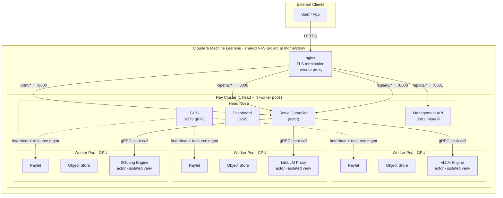
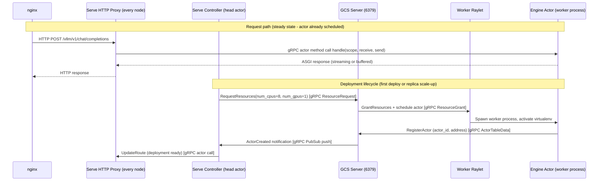
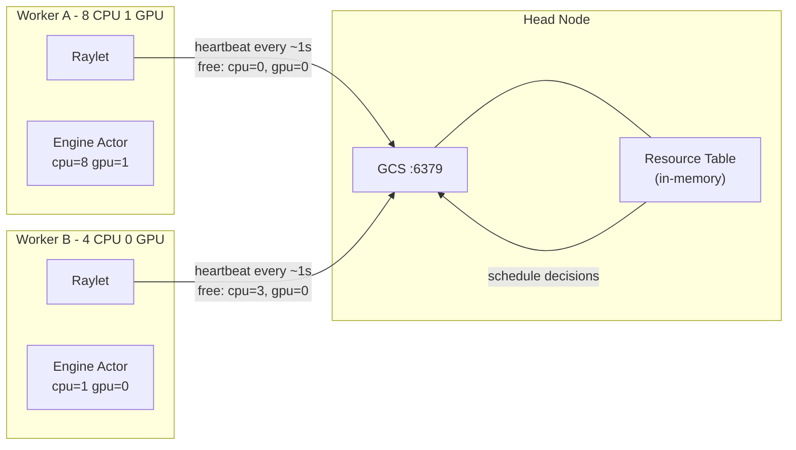
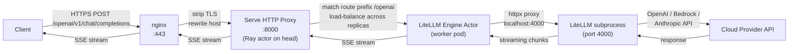
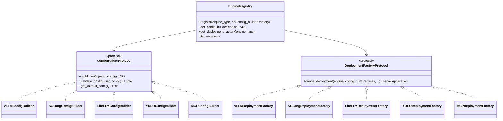
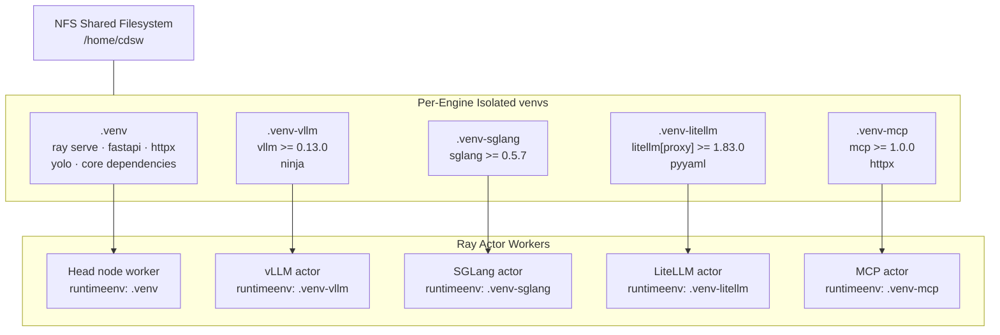
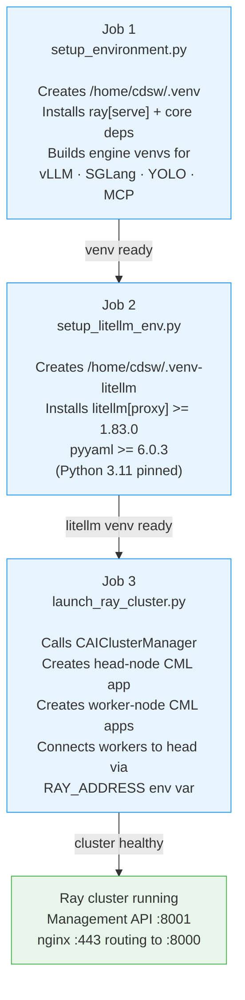
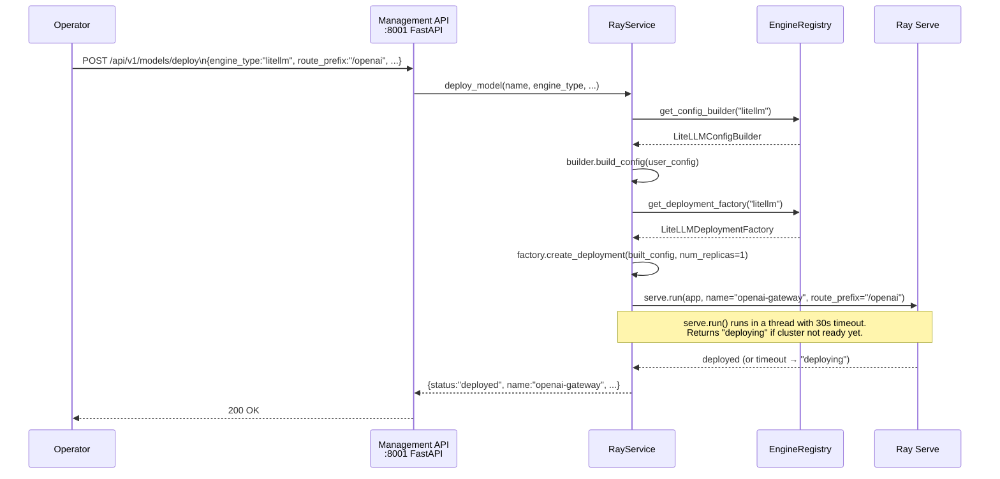
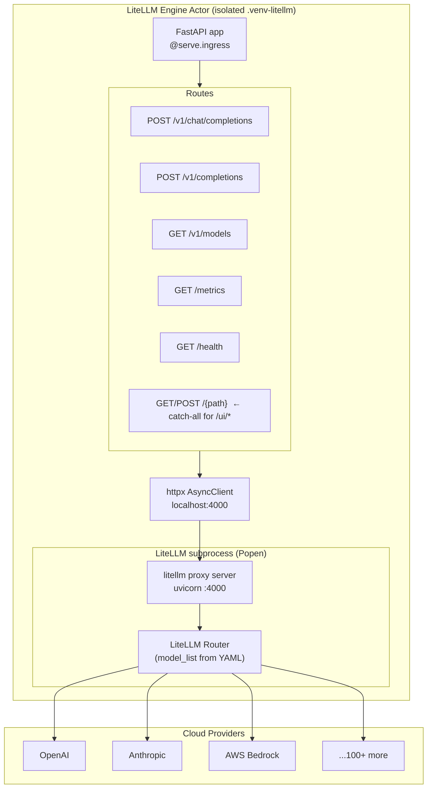

<!-- Space: ~7120206ec1ac3f0d904b368e459afb34c73d9a -->
<!-- Title: ray-serve-cai Architecture -->

# Architecture — ray-serve-cai

> **Last updated**: 2026-05  
> Replaces the previous architecture diagram which referenced removed components (`RayBackend`, `deploy_to_cml.py`, `cai_cluster.py`).

---

## 1. System Overview

ray-serve-cai is a **REST-based AI inference gateway** that runs inside Cloudera Machine Learning (CML). It exposes a single nginx-fronted HTTPS endpoint that routes to one or more Ray Serve deployments — each hosting an isolated inference engine (vLLM, SGLang, LiteLLM, YOLO, or MCP).

A lightweight **Management API** handles cluster lifecycle (deploy, delete, status) so operators never need to touch Ray internals directly.



---

## 2. Ray Cluster — gRPC Orchestration Deep Dive

Ray's inter-node communication is **entirely gRPC-based**. Understanding the topology is essential for debugging scheduling failures, resource starvation, and deployment timeouts.

### 2.1 Core daemons and their gRPC roles

| Daemon | Host | Port | Role |
|--------|------|------|------|
| **GCS Server** | Head only | 6379 | Central cluster brain — actor registry, placement groups, resource accounting, node membership |
| **Raylet** | Every node | ephemeral | Local scheduler + resource manager; bridges GCS ↔ local worker processes |
| **Object Store (Plasma)** | Every node | shared-mem | In-memory object cache; cross-node transfers use gRPC for metadata, raw TCP for bulk data |
| **Dashboard Agent** | Every node | ephemeral | Metrics and profiling, aggregates to Dashboard on :8265 |
| **Serve HTTP Proxy** | Every node | 8000 | Receives HTTP from nginx, routes to replica actors via `ServeHandle` |

### 2.2 gRPC message flows



### 2.3 Resource reporting loop

Every Raylet sends a **heartbeat** to GCS every ~1 second via gRPC. The heartbeat carries:
- Available CPU / GPU / custom resources
- Currently running actor count and memory pressure
- Node health status

GCS aggregates all heartbeats into a global resource table. When Ray Serve needs to place a new replica, it reads this table and picks the node with the most available resources matching the actor's `ray_actor_options`.



### 2.4 Cross-node object transfer

When a Ray task passes a large object (e.g., model weights, batched tensors) to a remote node, Plasma Object Store uses gRPC **only for the control plane** (locate / pin / unpin). The actual bytes travel over a direct TCP connection between the two Plasma daemons — bypassing gRPC to avoid its 4 MB default message size limit.

---

## 3. Request Flow — Client to Inference



**Key invariant**: the LiteLLM subprocess runs on `127.0.0.1` — it is never directly reachable from outside the pod. All external traffic arrives via nginx → Ray Serve → actor proxy.

---

## 4. Engine Plugin Architecture

All engines share the same four-part contract, registered in `ray_serve_cai/engines/__init__.py`:



### Subprocess-based engines (LiteLLM, SGLang)

LiteLLM and SGLang follow the same subprocess pattern:

```
Ray actor __init__()
  ├─ write config YAML/JSON to tempfile
  ├─ Popen([python_bin, server_script, --port, ...])
  ├─ poll /health until HTTP 200 (up to 120s)
  └─ self._base_url = "http://127.0.0.1:<port>"

incoming HTTP request
  └─ httpx.AsyncClient.request() → localhost:<port>
       └─ SSE stream or JSON response proxied back
```

The subprocess runs as a **child of the Ray actor process**, so it shares its lifecycle and isolated venv.

---

## 5. Per-Engine Isolated Virtual Environments

vLLM and SGLang conflict on the `llguidance` package and **cannot share a Python environment**. Every engine gets its own venv under `/home/cdsw`:



`ray_actor_options["runtime_env"]["virtualenv"]` tells Ray to activate the given venv inside the actor worker process before importing any user code. Ray validates the venv path during actor scheduling; if the path is missing the deployment fails immediately with a clear error.

**NFS-safe concurrent creation**: `setup_environment.py:setup_engine_venv()` uses `fcntl.flock` (exclusive file lock) so multiple CML application pods spinning up simultaneously do not corrupt a shared venv during creation.

---

## 6. CML Deployment Job Chain

The cluster bootstraps via a sequence of CML jobs. Each job runs to completion before the next starts.



After the cluster is healthy, operators use the Management REST API to deploy inference engines:

```
POST /api/v1/models/deploy
  → RayService.deploy_model()
  → EngineRegistry.get_config_builder(engine_type).build_config()
  → EngineRegistry.get_deployment_factory(engine_type).create_deployment()
  → serve.run(app, name=name, route_prefix=route_prefix)
```

---

## 7. Management API — Request Lifecycle



---

## 8. Current Module Structure

```
ray_serve_cai/                          ← importable library
├── __init__.py
├── engines/
│   ├── __init__.py                     ← registers all engines at import time
│   ├── registry.py                     ← EngineRegistry singleton
│   ├── base.py                         ← protocols: ConfigBuilder, DeploymentFactory
│   ├── engine_utils.py                 ← shared ASGI helpers
│   ├── vllm_engine.py / vllm_config.py
│   ├── sglang_engine.py / sglang_config.py
│   ├── litellm_engine.py / litellm_config.py   ← subprocess proxy (100+ providers)
│   ├── yolo_engine.py / yolo_config.py
│   └── mcp_engine.py / mcp_config.py
│   └── mcps/                           ← bundled MCP server implementations
└── management/
    ├── app.py                          ← FastAPI app, mounts all routers
    ├── api/
    │   ├── models.py                   ← /api/v1/models  (deploy / delete / list)
    │   ├── applications.py             ← /api/v1/applications
    │   ├── cluster.py                  ← /api/v1/cluster
    │   ├── nodes.py                    ← /api/v1/nodes
    │   └── metrics.py                  ← /api/v1/metrics
    ├── models/                         ← Pydantic request/response schemas
    └── services/
        ├── ray_service.py              ← serve.run / serve.delete / serve.status
        └── cai_service.py              ← CML application / node lifecycle

cai_integration/                        ← CML-specific job scripts (run, not imported)
├── setup_environment.py                ← Job 1: create .venv + engine venvs
├── setup_litellm_env.py                ← Job 2: create .venv-litellm
├── launch_ray_cluster_job.py           ← Job 3: start head + worker apps
└── ...

demo_configs/                           ← example deploy payloads
├── litellm_openai.json
├── vllm_model.json
└── ...
```

---

## 9. LiteLLM Engine — Internal Architecture

LiteLLM proxies to 100+ providers (OpenAI, Anthropic, AWS Bedrock, Azure, Vertex AI, Ollama, local vLLM, etc.) behind a single OpenAI-compatible interface.



**UI proxying**: LiteLLM ships a Next.js management UI at `/ui`. The catch-all route proxies all unmatched paths, rewrites `Location` headers (redirects), and patches root-relative asset paths (`/_next/`) in HTML responses so the browser stays within the `/openai` route prefix.

---

## 10. Key Design Invariants

| Invariant | Why it matters |
|-----------|---------------|
| Engine subprocesses bind to `127.0.0.1` only | Never exposed to the network directly; all ingress goes through the Ray actor HTTP layer |
| `runtime_env["virtualenv"]` is always set | Engine actors always activate the correct isolated venv, regardless of whether the path currently exists on the head node |
| `fcntl.flock` on venv creation | NFS-shared `/home/cdsw` is accessible by all CML pods simultaneously; without the lock, concurrent venv creation corrupts the environment |
| `route_prefix` threaded to `server_root_path` | Subprocess-based engines (LiteLLM, SGLang) need to know their public mount prefix to generate correct redirect and asset URLs |
| Management API runs on a separate port (:8001) | Keeps inference traffic (port 8000) separate from control-plane traffic; simplifies nginx ACLs |
