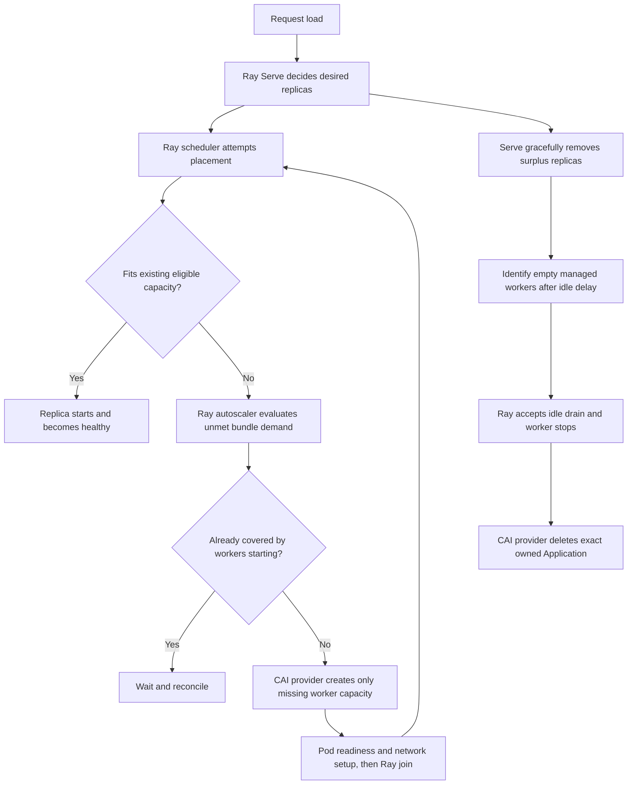

# CAI-backed Ray cluster autoscaling

Revision, 2026-09-29: new clusters start the controller by default and accept
multiple initial pools through `RAY_INITIAL_WORKER_POOLS` or YAML. Initial counts
are one-time requests, separate from retained minimums. Worker/GPU/CPU/RAM caps
are optional and checked against actual commitments, rather than reserving the
sum of all possible pool maxima. These decisions supersede the opt-in and
mandatory-cap proposals below. See [the current configuration guide](AUTOSCALING.md).
CAI admission is authoritative; quota discovery is not yet integrated. Confirmed
HTTP creation rejections back off; ambiguous outcomes retain their commitments.

Status: implementation in progress, 2026-09-28. The API cleanup, vLLM policy
separation, worker capacity controller, and idle-worker retirement have local
coverage. See [implementation and rollout](AUTOSCALING.md). CAI/GPU canary and
occupied-worker consolidation remain outstanding.

Integration-gate result: the pinned Ray 2.56.1 scheduler skipped existing nodes
without instance-manager records. That violates reuse of manual capacity. The
implementation therefore takes the planned fallback: one CAI reconciler using
Ray's resource scheduler with a complete protected inventory. No native worker
monitor runs alongside it. The adapter regression test verifies that two manual
one-GPU workers satisfy a TP=2 request without creating additional workers.

Baseline: merged AMP code at `c9161f8`, on `feature/auto_scaling`. The branch was
fast-forwarded from its initially outdated local-main base. Previous uncommitted
work remains in the named pre-branch stash.

## 1. Outcome and boundaries

Ray Serve scales deployment replicas according to demand. When those replicas
cannot fit on the existing cluster, additional CAI Applications supply Ray worker
capacity. Existing compatible capacity and workers already being provisioned are
considered before any new CAI creation. After Serve removes replicas, only workers
that are safe to retire are deleted through the CAI API.

Here a Ray node is a process running inside a CAI Application pod. A physical
Kubernetes node is a separate infrastructure layer. This feature creates CAI
Applications; it does not itself provision Kubernetes machines. CAI quotas and
underlying GPU availability remain constraints.

Initial scope: opt-in autoscaling of the tested vLLM serving path, fixed resources
and fixed tensor-parallel size per replica. Existing manual workers remain usable.
Do not claim elastic training support or resize a running TP replica. Other
engines and arbitrary Serve applications need explicit capability validation.

## 2. Baseline findings before implementation

| Area | Current behavior | Consequence |
|---|---|---|
| Direct worker creation | `CAIService.create_worker_node()` constructs a worker directly when CPU and memory are supplied. `node_type` may be omitted or unregistered. | Registration is not required for the new flow. |
| Legacy templates | The service still looks up a registered template when CPU or memory is omitted. All three node-type routes remain public. | The prerequisite is removed, but legacy functionality has not been formally retired. |
| Documentation | README's AMP steps and manifest descriptions still prescribe node-type registration. `AMP_INPUT_SAFE_IMPORT.md` documents direct creation correctly. | Update onboarding before removing API discoverability. |
| Swagger | OpenAPI currently has 31 operations. Only `GET /resources/workers` has `deprecated=True`; `/applications/model` is already hidden. | Hide confirmed legacy routes with `include_in_schema=False`, not strikethrough entries. |
| Serve autoscaling | The model API accepts `autoscaling_config`; factories partially forward it. | Accepted payloads alone do not prove working autoscaling. |
| vLLM arguments | The factory puts `autoscaling_config` into Serve options and leaves the same key in the config bound to the engine. The engine passes that config to `AsyncEngineArgs`. | Separate deployment settings from engine constructor arguments before enabling autoscaling. |
| Raw import path | The API does not forward `autoscaling_config` on the raw path; bound applications also bypass deployment option application. | Implement supported handling or reject unsupported overrides explicitly. |
| Worker identity | Persisted records include `worker_id`, `launch_id`, CAI app ID and resolved worker spec. Live joins validate the launch identity. | Reuse this identity model; do not infer ownership from IPs or display names. |
| Worker removal | `remove_worker_node()` calls the CAI delete path without workload or drain checks. | It cannot be used directly as an autoscaler termination callback. |
| Capacity reporting | `/capacity` is aggregate Ray capacity. `/allocation` is legacy bookkeeping of workers and separately launched CAI apps. | Neither provides the per-node, placement-group-aware fit or emptiness proof needed here. |
| Node occupancy | Enrichment reads `ResourcesUsed` with a default of `{}`. | An empty field is not evidence that a worker is empty. |
| Labels | `labels` is descriptive metadata; `ray_labels` becomes numeric Ray custom resources; `node_label` steers Kubernetes placement. | Keep these meanings separate in the API and planner. |
| Versions | AMP setup pins Ray 2.56.1; this development environment has Ray 2.53.0. | Version-sensitive integration must run against 2.56.1 on the cluster. |

Relevant code: [worker service](../ray_serve_cai/management/services/cai_service.py),
[resource routes](../ray_serve_cai/management/api/resources.py),
[coordinator](../ray_serve_cai/management/services/coordinator.py),
[model deployment service](../ray_serve_cai/management/services/ray_service.py),
[vLLM factory](../ray_serve_cai/engines/vllm_engine.py), and
[direct-worker tests](../tests/test_direct_workers.py).

Verification performed: all 24 direct-worker and node-type tests passed locally.
These tests mock CAI calls; they do not establish live autoscaler behavior.

## 3. Endpoint cleanup comes first

Preserve a single documented manual creation flow:

```http
POST /api/v1/resources/nodes
```

```json
{
  "name": "l40s-worker-01",
  "cpu": 16,
  "memory": 64,
  "gpus": 1,
  "accelerator_type": "L40S",
  "node_type": "gpu-worker"
}
```

This uses the configured worker runtime; supply `runtime_identifier` or
`node_label` when required by the target Workbench. `node_type` here is an
optional scheduling label, not a pre-registered resource definition.

| Route | Proposed treatment |
|---|---|
| `POST /resources/nodes` | Keep visible; make direct CPU/memory examples and descriptions the default. |
| `GET /resources/nodes` | Keep visible for live membership and identity. |
| `GET /resources/worker-apps` | Keep visible for desired specs and workers that have not joined; it is not redundant with `/nodes`. |
| `DELETE /resources/nodes/{app_id}` | Keep visible; add the safe drain/removal behavior described below. |
| `GET /resources/capacity` | Keep visible; document aggregate scheduling resources, not GPU utilization or per-node fit. |
| `POST/GET /resources/node-types`, `DELETE /resources/node-types/{node_type}` | Hide from Swagger initially and document as legacy compatibility. Remove handlers only in a separately identified breaking change. |
| `GET /resources/workers` | Hide from Swagger; retain compatibility response during migration. |
| `POST /applications/model` | Keep its existing hidden redirect. |
| `/resources/allocation` and `/cml-apps` | Audit callers and purpose before retiring. They are not authoritative worker capacity APIs. Their absence from our normal workflow does not prove no users depend on them. |
| Remaining application, environment, engine, cluster and metrics APIs | Retain unless a concrete replacement or caller audit supports removal. |

Cleanup includes README, manifest descriptions, API guide, demo payloads and
recovery examples. Retain template compatibility tests until the legacy routes
are actually removed. Test both runtime route behavior and generated OpenAPI.

Do not remove the optional `node_type` scheduling label just because the
node-type registration API disappears from Swagger. Do not reintroduce mandatory
registration under a different name.

## 4. Control ownership and architecture decision

Use Ray Serve for replica decisions and Ray's resource scheduler for worker
capacity planning. The integration gate below selected a CAI reconciler with a
complete inventory adapter instead of the preferred native external provider.
This retains Ray's planning of pending actors, complete placement groups, and
workers already in flight. A separate metrics loop must not compete with Serve
over replica counts.

Replica policy is per Serve deployment. A Serve application can contain multiple
deployments, so identify demand and occupancy by application, deployment and
replica/placement-group IDs rather than treating an application as one actor.
Custom queue, latency or token metrics can later feed a supported Serve policy;
the CAI provider still responds to the resulting resource demand.



The pending replica expresses demand before the extra worker exists; it becomes
running only after capacity is ready. We do not need to write the replica count
again after creating workers.

The original preferred design used Ray 2.56.1's `NodeProviderAdapter` for external providers.
Ray's autoscaler constructs this adapter
and can disable SSH-style node updaters. CAI launchers already start Ray inside
the application, so reuse that launch mechanism. This is a preferred integration
direction, not a claim that CAI is already a supported upstream provider.

**Integration gate:** prove external-provider registration, provider-instance to
Ray-node identity, reporting of manually added capacity, pending TP groups,
idle rejection, and recovery against the pinned version before committing the
feature to this implementation. Keep all Ray internal API usage in a small,
version-tested adapter. The manual-capacity test failed for the native path, so
the implementation uses the planned CAI reconciler fallback. The live CAI
portion of the gate remains outstanding. Do not run two worker autoscalers
concurrently.

Place CAI provider/launcher integration under `cai_integration/autoscaling/`.
Keep generic resource specifications, occupancy and Ray adapters under
`ray_serve_cai/`. New generic code must not import the CAI integration package.
Reuse existing worker lifecycle services through injected interfaces rather than
adding another independent implementation of worker creation.

Start one supervised worker autoscaler associated with the head, outside request
handlers. It needs explicit cluster ownership and a single active leader. Audit
the existing Ray monitor startup so enabling it does not also leave a conflicting
monitor active. Pausing prevents new mutations while status remains available.

## 5. Capacity policy without mandatory node-type registration

Manual `POST /nodes` remains a one-call operation. Autonomous creation requires
an approved launch specification: GPU count alone cannot determine CPU, memory,
runtime, Kubernetes pool placement, or quotas.

Proposed cluster-level policy API:

- `GET/PUT /api/v1/cluster/autoscaling`: read/update policy; default disabled.
- `GET /api/v1/cluster/autoscaling/status`: mode, readiness, unmet demand,
  workers starting/draining, limits and blocking reasons.
- `GET /api/v1/cluster/autoscaling/events`: decisions and operation results.

Policy writes require the existing admin authorization; reads require normal
management authentication. Lowering a maximum must not force-delete occupied
workers. Report the excess and reclaim it through the normal safe lifecycle.

Proposed configuration shape, not an executable API payload yet:

```json
{
  "enabled": true,
  "mode": "observe",
  "max_workers": 6,
  "max_gpus": 6,
  "pools": [
    {
      "id": "l40s-serving",
      "min_workers": 0,
      "max_workers": 6,
      "idle_timeout_s": 900,
      "worker_spec": {
        "cpu": 16,
        "memory": 64,
        "gpus": 1,
        "accelerator_type": "L40S",
        "node_type": "gpu-worker"
      }
    }
  ]
}
```

Pool definitions hold inline worker specs and lifecycle limits. They are optional
autoscaling policy, not a prerequisite for creating individual workers. Generate
any native Ray autoscaler `available_node_types` entries internally. Resolve and
persist the effective runtime rather than silently changing it on restart.
Support multiple pools and a deterministic selection preference when more than
one shape fits. Enforce global limits as well as per-pool limits.

Keep `autoscaling_config` in the model deployment payload for replica limits and
request targets. Keep worker provisioning settings out of `AsyncEngineArgs`.
Use the normal head Workbench identity for CAI calls and report credential
failures without copying a short-lived setup-job token into a persistent policy.

## 6. Scale-up rules

1. Read fresh Ray per-node capacity, pending task/actor demand and placement-group
   demand, together with the provider's persisted starting workers.
2. Reuse eligible existing workers, including manual workers where constraints
   allow them. Never require an artificial new-pool label that makes all existing
   compatible workers invisible by default.
3. Respect the whole replica topology: scheduler CPU bundle, GPU bundles,
   accelerator, runtime capability, custom resources and placement strategy.
   Bundle 0 reservations already contain the deployment actor allocation; do not
   count that actor twice. Existing placement-group reservations are not free
   capacity, even when their GPU kernels are momentarily idle.
4. Deduplicate unresolved demand, subtract compatible launch commitments, and
   create only the missing capacity. Serialize decisions under one leader and
   revalidate before issuing CAI mutations.
5. Apply pool/cluster CPU, RAM, GPU and worker limits, CAI quota checks when
   available, launch concurrency limits, backoff and startup deadlines. If the
   complete additional replica cannot fit the allowed inventory, report why.
6. A successful CAI create returns an application, not a ready Ray worker. Track
   create, pod startup, network readiness, Ray join and replica model loading
   separately. A slow model download or failed runtime is not a reason to keep
   creating more workers for an already allocated replica.

Examples for TP=2 with two one-GPU executor bundles:

| Eligible state | Required behavior |
|---|---|
| Two free one-GPU workers and enough scheduler CPU | Create zero workers. |
| One free one-GPU worker | Create one compatible worker, if all constraints fit. |
| No free GPU capacity | Create two one-GPU workers for the replica. |
| One free worker plus one compatible worker already starting | Wait; do not launch a duplicate. |
| `STRICT_PACK` requires both GPU bundles on one node, but only one-GPU shapes are allowed | Report unsatisfiable policy; two separate workers do not solve it. |
| Free GPUs exist but lack a required accelerator/affinity resource | They do not satisfy demand. |

GPU utilization is useful telemetry but is not the capacity signal: an idle
GPU-resident model still owns its reservation and memory. CAI memory is GiB of
pod RAM; Ray's advertised schedulable memory is different after runtime/object
store overhead. Calibrate advertised worker resources accordingly.

## 7. New workers must inherit network readiness

The existing [cross-node GPU runbook](CROSS_NODE_GPU_DEPLOYMENT.md) targets
selected pods. Unattended autoscaling cannot depend on rerunning the local fish
script with each new pod name.

For pools allowing cross-pod TP, establish an administrator-installed, narrowly
selected mesh policy and a supported way to attach its selector to every new
worker pod. This can be a platform pod-template option, admission configuration,
or an explicit infrastructure-side controller; confirm what Workbench exposes.
Do not assume our metadata `labels` field sets Kubernetes pod labels.

Keep Istio injection and CAI service connectivity intact. Gate worker Ray startup
on the required network configuration so Ray cannot schedule GPU work in the gap
between node join and sidecar readiness. Verify TCPStore/Gloo/NCCL and then real
inference on automatically created pods. If this provisioning hook is absent,
report cross-pod autoscaling as blocked; single-pod replicas can be the first
rollout. A manually passed collective probe is not a permanent readiness signal
for future pods.

## 8. Scale-down: empty-worker safety and consolidation

**Initial release:** let Serve lower its desired count, gracefully finish requests,
terminate replicas and release their placement groups. Then reclaim workers
that are genuinely empty after an idle interval. Do not move active replicas in
this first release.

For every candidate:

1. Confirm it is a current launch owned by this cluster's autoscaler, not the
   head, a monitoring app, a manually created worker, or an unknown CAI app.
   Manual workers require explicit adoption before automated deletion.
2. Require fresh, complete occupancy evidence: no Serve replica, engine child
   actor, running/assigned task, live non-Serve actor, or placement-group bundle
   using the node. Respect Ray's activity/object state and infrastructure actors.
   Missing or truncated state means unknown, not empty.
3. Check warm-capacity minimums, cooldown, pending demand and in-flight launches.
   Do not recycle a worker that is needed by current demand.
4. Request a Ray idle drain using the rejectable idle-termination reason. This
   addresses the race where new work arrives after the emptiness snapshot. If
   Ray refuses, retain the worker and re-evaluate. Never substitute preemption
   or force termination for an ordinary scale-down.
5. Confirm the accepted drain prevents new placement and the expected raylet
   exits. Verify that the CAI launcher does not rejoin or restart under a new Ray
   identity before deletion. Reconcile any changed launch ID.
6. Delete the exact CAI Application, confirm its disappearance, and retain a
   tombstone/audit event. A timeout leaves termination unresolved; do not drop
   the identity or claim capacity was released.

The current method called `stop_application` actually deletes the CAI Application.
Use the same safe removal protocol for manual worker deletion and prevent
generic `/cml-apps/{app_id}` from bypassing it for managed workers. An explicit
operator force-removal feature, if retained, must be separate from autoscaling.

**Consolidation milestone:** partially occupied nodes may remain after scale-down.
Empty-worker deletion guarantees safe removal, not that lowering replica counts
will produce an empty worker. Consolidation is required for the intended ability
to reclaim partially occupied workers; it follows the empty-worker safety
milestone rather than being implied by it.
Labels constrain placement; they do not migrate a running actor. To reclaim
those nodes, create and warm replacement replicas on retained eligible nodes,
verify they can serve traffic, then gracefully retire the selected old replicas.
Treat a TP replica and all of its bundles/child actors as one relocation unit.
Never move or delete one TP shard independently.

Do a version-specific design for targeted replica replacement and traffic drain;
do not assume a public single-replica migration API exists. Require surge
capacity and request/stream completion. If capacity is insufficient or stateful
work cannot be relocated, keep the occupied worker and explain the constraint.

## 9. Labels and identity contract

| Field/concept | Role |
|---|---|
| `labels` today | Descriptive API metadata only. |
| `node_label` today | Kubernetes physical-node selector for a CAI worker pod; current launch path uses its first entry. |
| `ray_labels` today | Numeric custom scheduling resources consumed by actors or bundles. |
| Native Ray node labels | A separate scheduling feature; introduce only with pinned-version tests for actors and placement groups. |
| `worker_id` / `launch_id` / `app_id` / `ray_node_id` | Stable worker identity, current incarnation, CAI deletion target, live Ray identity. |
| `cluster_id`, `pool_id`, `managed_by` (proposed) | Explicit ownership and scaling policy, persisted independently of user labels. |

Prefer replaceable capability/pool constraints over hard pod IP or Ray node-ID
pins for autoscaled deployments. Reject or explicitly exempt requests that pin
an irreplaceable worker. Adding new capacity cannot satisfy such a pin.

### Placement constraints and controlled replacement

Pinning controls where a new actor or placement-group bundle starts. It does not
move an existing replica or establish that its previous worker is empty.
Separate the user's durable requirements from a controller's temporary placement
decision:

- Durable requirements describe compatible workers, for example
  `node_type:gpu-worker`, `accelerator_type:L40S`, or a custom pool resource.
  Newly created workers must advertise those capabilities at Ray startup.
- A consolidation operation selects retained workers that satisfy those
  requirements, checks capacity for the complete replica, and reserves capacity
  through its replacement placement group. A capacity snapshot is not a
  reservation.
- Existing server-generated `worker_id:<id>` and `worker_launch_id:<id>` custom
  resources can constrain individual replacement bundles to selected worker
  incarnations. These are internal, temporary decisions. Do not persist them as
  the user's deployment policy or ask the autoscaler to create arbitrary new
  nodes to satisfy a stale identity pin.
- `scheduling.resources` is merged into every GPU bundle by the current vLLM
  factory. Therefore a single worker identity there would pin every TP shard to
  that worker. To select different workers, put each identity in its respective
  `placement_group_bundles` entry. Keep at most one GPU per bundle.
- The CPU scheduler bundle also needs placement outside the retiring worker.
  The current generated multi-node layout intentionally leaves it unrestricted;
  pinning only GPU bundles does not guarantee the retirement candidate empties.
- A replacement operation must coordinate with Serve's desired count and
  gracefully retire the selected originals. Updating deployment-wide bundles
  changes the template for all replicas; it is not a public per-replica migration
  command. Validate the version-specific lifecycle integration before exposing
  consolidation.

During consolidation, exclude the candidate from new managed placements and
coordinate concurrent scale-up/replacement operations. This management state is
not a global Ray scheduling fence: unmanaged work can still make the worker
busy. The final rejectable idle drain remains mandatory, and a busy or uncertain
worker is retained. Do not pretend changing API metadata labels cordons Ray.

**Pinned-source findings (Ray 2.56.1):** the default Serve scheduler prioritizes
downscaling replicas on nodes with fewer Serve replicas, but explicitly does not
account for other non-Serve actors. Its packing path is gated off when any
registered deployment has a non-STRICT_PACK placement group, which includes our
cross-node TP `PACK` layout. The default `get_node_to_compact()` returns `None`.
Serve has draining-node replica migration code, but its eligibility checks use
the Serve replica actor's node. Our GPU executor actors can live on other nodes,
so this cannot be assumed to cover a GPU-only retirement candidate. Ray Serve
replica gangs are also not automatically the same thing as vLLM TP ranks.

Prefer reusing verified Serve lifecycle behavior over inventing a second replica
controller, but require an integration test retiring a worker that hosts only a
TP executor. Native Ray string labels and per-bundle selectors can be introduced
as a separate API extension after testing the full Serve path on the pinned
version; do not silently reinterpret existing numeric `ray_labels`.

## 10. Persistence, failures and observability

Persist policy revision, operation ID, immutable resolved launch spec, ownership,
requested/observed lifecycle state, and all current identity mappings. Serialize
cross-process writes and use a durable operation journal; atomic rename alone
does not prevent two writers from losing each other's updates.

Creation timeouts may follow successful CAI creation. Reconcile the recorded
launch operation against CAI before retrying; use the existing `launch_unknown`
behavior as the starting point. Ensure native-provider retries cannot create
duplicate apps after an unknown outcome. Verify deletion by identity similarly.

Head recovery and autoscaling must share a mutation lock/leader protocol. Existing
recovery restores all saved workers, so distinguish retained desired workers
from workers draining/terminated and reconcile current policy before restoring
capacity. Persisted intent is not live state. Never recover and autoscale the
same worker independently.

Expose desired/running/pending replicas; pending bundle shapes and reasons;
managed/manual/starting/draining workers; quota/limit blocks; create-to-join and
join-to-model-ready latency; drain rejection reason; CAI failures and backoff.
Include actions such as `reuse_existing_capacity`, `wait_for_launch`,
`launch_worker`, `retain_busy_worker`, and `delete_drained_worker` in events.
Missing state or expired authentication pauses mutations and reports the error.

## 11. Implementation sequence and acceptance gates

| Phase | Deliverable | Required proof |
|---|---|---|
| 0: API cleanup | Direct creation as documented default; hide legacy Swagger routes; migration notes. | Direct creation works with no registry; legacy requests still work during compatibility period; OpenAPI has no legacy strikethrough operations. |
| 1: Serve configuration | Separate engine/Serve options, validate autoscaling settings and unsupported paths, expose request-concurrency controls. | Fixed replicas remain unchanged; vLLM autoscaling reaches Serve but not AsyncEngineArgs; run both generated and caller-supplied placement-group tests. |
| 2: Provider integration spike | Pinned Ray external CAI provider, lifecycle identity, one monitor, durable operations, observed demand/status. | Local contract tests plus a small live CAI trial; manual capacity is counted, foreign workers are protected, idle drains reject busy nodes, restarting the controller does not duplicate launches. |
| 3: Observe then scale-up only | Policy, complete-bundle fit, launch limits, readiness and mesh integration. | Existing capacity causes no CAI create; one missing GPU creates one worker; TP gang, incompatible labels, impossible topology and startup timeouts are reported correctly. |
| 4: Empty-worker scale-down | Serve-first reduction, full occupancy, rejectable drain, verified CAI deletion. | A streaming request is allowed to finish; child actors and non-Serve jobs block removal; a racing new task prevents deletion; failed/uncertain CAI calls preserve recoverable identity. |
| 5: Consolidation | Explicit replica replacement on retained nodes with a disruption budget. | Mixed deployments and TP groups relocate without partial shard termination or dropping requests; no-surge-capacity cases retain workers. |

Phase 2 is the go/no-go gate for the native provider design. If it fails, record
the precise missing contract before selecting the custom reconciler fallback.

Rollout modes: `disabled` -> `observe` -> `scale_up_only` -> `full`.
Start with one warm serving replica and a modest maximum. Scale-to-zero needs
separate cold-start, proxy queue and timeout testing; an app health endpoint does
not establish that a new replica can generate tokens.

End-to-end test scenarios must include two applications contending for the same
pool, two one-GPU nodes supporting a TP=2 replica, several replicas sharing one
worker, manual workers, occupied worker with zero GPU utilization, controller
restart, CAI quota rejection, lost API responses, head recovery, mesh failure on
a new pod, and renewed demand during scale-down. Measure failed requests as well
as capacity changes. No live cluster mutation was performed for this plan.

## References

- [Ray Serve autoscaling and its relationship to worker autoscaling](https://docs.ray.io/en/latest/serve/autoscaling-guide.html)
- [Ray 2.56.1 autoscaler provider and lifecycle integration](https://github.com/ray-project/ray/blob/ray-2.56.1/python/ray/autoscaler/v2/autoscaler.py)
- [Ray 2.56.1 provider interfaces and adapter](https://github.com/ray-project/ray/blob/ray-2.56.1/python/ray/autoscaler/v2/instance_manager/node_provider.py)
- [Ray 2.56.1 provider configuration and updater control](https://github.com/ray-project/ray/blob/ray-2.56.1/python/ray/autoscaler/v2/instance_manager/config.py)
- [Ray 2.56.1 resource-state and status access](https://github.com/ray-project/ray/blob/ray-2.56.1/python/ray/autoscaler/v2/sdk.py)
- [Ray 2.56.1 drain reasons, node states and pending gang requests](https://github.com/ray-project/ray/blob/ray-2.56.1/src/ray/protobuf/autoscaler.proto)
- [Ray 2.56.1 drain command and API-stability caveat](https://github.com/ray-project/ray/blob/ray-2.56.1/python/ray/scripts/scripts.py)
- [Ray label scheduling](https://docs.ray.io/en/latest/ray-core/scheduling/labels.html)
- [Ray 2.56.1 Serve placement and downscale selection](https://github.com/ray-project/ray/blob/ray-2.56.1/python/ray/serve/_private/deployment_scheduler.py)
- [Ray 2.56.1 Serve draining-node replica migration](https://github.com/ray-project/ray/blob/ray-2.56.1/python/ray/serve/_private/deployment_state.py)

Latest documentation is conceptual context. The pinned source and live 2.56.1
integration tests decide which contracts this implementation can rely on.
