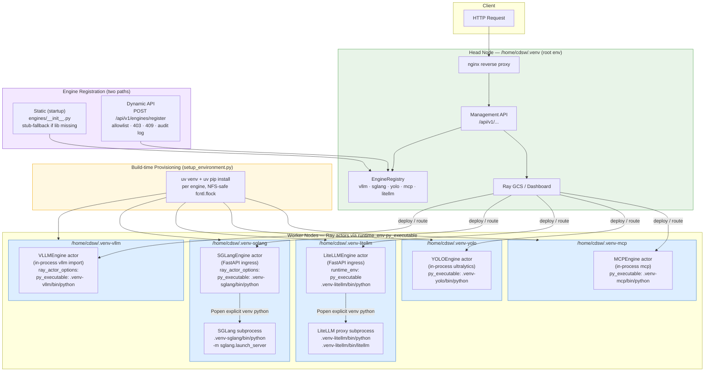

# Isolated Inference Environments — Architecture

Each inference engine runs in its own NFS-mounted venv to prevent dependency conflicts
(e.g. vLLM and SGLang require mutually exclusive `llguidance` versions). The head node
runs only the root env and never imports engine packages.

## Architecture Diagram

## Key Design Rules

| Rule | Detail |
|---|---|
| **Root venv is engine-free** | `/home/cdsw/.venv` contains only `ray[serve]`, FastAPI, nginx, management deps. `import vllm/sglang/litellm` on the head raises `ImportError`. |
| **`py_executable` for isolation** | All factories set `ray_actor_options["runtime_env"] = {"py_executable": f"{venv}/bin/python"}`. Ray starts the actor worker process under the specified interpreter. |
| **Subprocess engines use explicit Python** | SGLang and LiteLLM launch a child process; both use the venv Python path directly (`{venv}/bin/python -m sglang.launch_server`, `{venv}/bin/python {venv}/bin/litellm`), not `sys.executable`. |
| **NFS-safe provisioning** | `setup_environment.py` uses `fcntl.flock` on `.venv-<engine>.lock` to prevent concurrent venv creation races on shared NFS. |
| **Fail loud, no pip fallback** | If a per-engine venv doesn't exist the factory skips wiring `py_executable` (venv path check) and Ray falls back to the root env — making the missing venv visible immediately. |
| **Head-safe registration** | `engines/__init__.py` imports only config/factory modules (no heavy libs) and falls back to a stub class if the engine module can't import. All 5 engines always register. |

## Venv Contents

| Venv | Path | Contents |
|---|---|---|
| root | `/home/cdsw/.venv` | `ray[serve]`, `fastapi`, `uvicorn`, `httpx`, `pyyaml`, `jinja2`, nginx |
| vllm | `/home/cdsw/.venv-vllm` | `ray[serve]`, `vllm>=0.13.0` |
| sglang | `/home/cdsw/.venv-sglang` | `ray[serve]`, `sglang>=0.5.7` |
| yolo | `/home/cdsw/.venv-yolo` | `ray[serve]`, `ultralytics`, `Pillow` |
| mcp | `/home/cdsw/.venv-mcp` | `ray[serve]`, `mcp`, `httpx` |
| litellm | `/home/cdsw/.venv-litellm` | `litellm[proxy]`, `pyyaml` |
